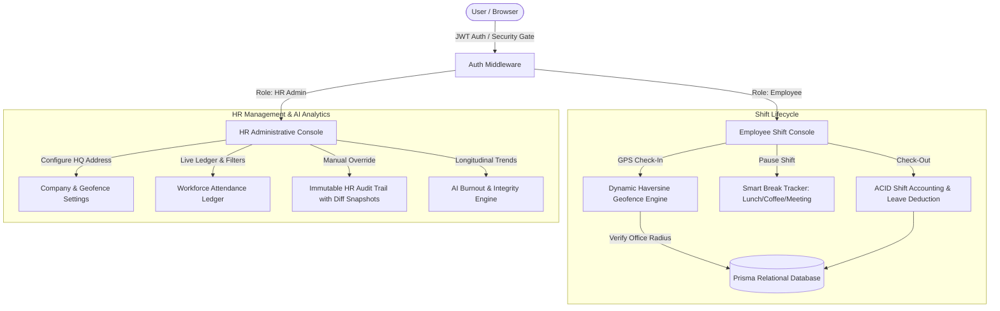

# WorkPulse — Enterprise Attendance & Workforce Productivity Platform

> **WorkPulse** is a modern, production-grade Enterprise Employee Attendance, Geofencing, and Workforce Productivity Management platform.  
> **Tech Stack:** Node.js / Express • Prisma ORM • SQLite / PostgreSQL • React 18 (Vite) • Tailwind CSS • Recharts • jsPDF  

---

## 📋 Project Requirements Compliance Matrix

Every required feature is fully implemented and tested with financial-grade precision:

| # | Required Feature | Implementation Status | Key Components & Logic |
| :---: | :--- | :---: | :--- |
| **1** | **Employee Login & Registration** |  **100% Implemented** | Dual-role RBAC (`Employee` / `HR`), bcrypt hashed passwords, JWT authentication, department assignment, and an Admin Security Passcode Gatekeeper (`Admin@123`). |
| **2** | **Attendance Check-In / Check-Out** |  **100% Implemented** | Monospace digital shift timer, instant check-in/out triggers, geolocation capture, and Haversine distance verification against the office geofence. |
| **3** | **Working Hours Calculation** |  **100% Implemented** | Automated net working hours: $\text{Net Hours} = (\text{CheckOut} - \text{CheckIn}) - \sum \text{Break Durations}$. Supports Lunch, Coffee, and Meeting pause tracking. |
| **4** | **Leave Deduction Calculation** |  **100% Implemented** | ACID transactional deductions: $\ge 8.0\text{h} \implies 0\text{d}$, $4.0 - 7.9\text{h} \implies -0.5\text{d (Half Day)}$, $<4.0\text{h} \implies -1.0\text{d (Absent)}$. Auto-updates remaining leave balance. |
| **5** | **HR Dashboard** |  **100% Implemented** | Real-time workforce metrics, searchable/filterable attendance ledger, AI Burnout & Integrity scores, immutable audit trail with before/after diffs, and System Settings. |
| **6** | **Employee Dashboard** |  **100% Implemented** | Personal shift console, live stopwatch, interactive monthly calendar grid, shift breakdown history, personal integrity ratings, and branded PDF transcript export. |
| **7** | **Attendance Status Tracking** |  **100% Implemented** | Real-time status badges (`Present`, `Late` >09:30 AM, `Half Day`, `Absent`, `On Leave`), remote vs office geofence detection, and audit edit tags. |

---

## 🌟 Key Capabilities & System Features

### 🚀 Core Features
1. **Dynamic Office Location & Geofence GPS Engine:**
   - HR Admins can dynamically configure the Office Name/Address, Latitude, Longitude, and Allowed Geofence Radius directly from the Admin Dashboard or via device GPS auto-detection.
   - Live distance is computed using the **Haversine Geodesic Algorithm**. Check-ins recorded beyond the configured perimeter are flagged in real-time as `Remote / Out of Bounds`.
2. **Role-Based Access Control & Admin Security Gatekeeper:**
   - Dual-role authentication (`Employee` and `HR / Admin`) with JWT session authorization and bcrypt password hashing.
   - **Admin Registration Security Gate:** Public registration allows standard `Employee` accounts. Creating an `HR / Admin` account strictly requires an **Organization Admin Security Key** (`Admin@123`), preventing unauthorized administrative privilege escalation.
3. **Live Shift Stopwatch & Smart Break Tracker:**
   - Monospace digital shift timer with instant Check-In and Check-Out triggers.
   - Break Tracker supporting **Lunch**, **Coffee**, and **Meeting** intervals with dynamic net-hour deduction upon checkout.
4. **Financial-Grade ACID Calculations & Leave Deductions:**
   - **Shift Cutoff:** Check-ins after 09:30 AM mark status as `Late`.
   - **Absent Rule:** $\text{Net Hours} < 4.0\text{h} \implies \text{\textbf{Absent}}$ $\rightarrow$ Atomically deducts **$1.0\text{ Day}$** from `leave_balance`.
   - **Half Day Rule:** $4.0\text{h} \le \text{Net Hours} < 8.0\text{h} \implies \text{\textbf{Half Day}}$ $\rightarrow$ Atomically deducts **$0.5\text{ Day}$** from `leave_balance`.
   - **Present Rule:** $\text{Net Hours} \ge 8.0\text{h} \implies \text{\textbf{Present}}$ (or `Late`) $\rightarrow$ Deducts **$0.0\text{ Days}$**.
   - Atomic database transactions (`prisma.$transaction`) ensure zero partial state corruption or phantom leave balances.
5. **AI Attendance Integrity & Burnout Risk Analytics Engine:**
   - **Integrity Index ($0–100\%$):** Real-time punctuality, consistency, and compliance rating (Grade A+ to D).
   - **Burnout Alert System:** Analyzes multi-week longitudinal trends. Automatically flags staff exceeding **$>50\text{ working hours/week}$** for $\ge 3$ consecutive rolling weeks with actionable HR recommendations.
6. **Immutable HR Audit Logging:**
   - Every administrative override (modifying shift timestamps, changing attendance statuses, or overriding leave balances) writes an append-only record to the `audit_logs` table with full before/after JSON diff snapshots.
7. **Automated Employee Email Notifications (`nodemailer`):**
   - Whenever an administrative change is performed (Attendance Record Edit, Leave Balance Adjustment, or Account Deletion), an automated HTML/plain-text notification email is generated and dispatched to the employee with modified fields, the admin's name, and the administrative reason. Supports live SMTP (Gmail, Outlook, SendGrid, etc.) or local development logging.
8. **Automated PDF Transcript Generation:**
   - Built with `jsPDF` + `jspdf-autotable` to export branded personal attendance statements and master workforce compliance audits.

---

## 🏛️ System Architecture



---

## 🔑 Default Accounts & Credentials

The system comes pre-configured with the following baseline accounts:

| Full Name | Role | Email / Username | Password | Access Level |
| :--- | :--- | :--- | :--- | :--- |
| **Vikram Mehta** | **HR / Admin** | `admin@innereye.com` | `Admin@123` | Full HR Console, Geofencing Settings, Audit Trail & AI Analytics |
| **John Doe** | **Employee** | `john.doe@innereye.com` | `Employee@123` | Shift Console, Break Tracker, Personal Attendance Log & PDF Export |
| **Alex Rivera** | **Employee** | `alex.rivera@innereye.com` | `Employee@123` | Shift Console, Personal Attendance Log & Burnout Indicators |
| **olina** | **Employee** | `kunduolina@gmail.com` | *(User password)* | Shift Console, Personal Attendance Log & Summary Export |

> **Note on New Registrations:**  
> - Users can create new **Employee** accounts freely via the **Sign Up** tab on the login page.  
> - To create an **HR / Admin** account, enter the organization security passcode: **`Admin@123`** (configurable via `ADMIN_REGISTRATION_KEY`).

---

## 🛠️ Setup & Running Locally

### Prerequisites
- **Node.js** (v18.x, v20.x, or v22.x)
- **npm** (v9.x or v10.x)

---

### Step 1: Install Dependencies
```bash
# Install backend dependencies
cd backend
npm install

# Install frontend dependencies
cd ../frontend
npm install
```

### Step 2: Initialize Database
```bash
cd backend
npx prisma db push
```

### Step 3: Start the Backend API Server
```bash
cd backend
npm start
# Server starts at http://localhost:5000
# Health check available at http://localhost:5000/api/health
```

### Step 4: Start the Frontend Application
```bash
cd frontend
npm run dev
# Frontend starts at http://localhost:3000
```

Open **`http://localhost:3000`** in your browser to access **WorkPulse**.

---

### 📧 Configuring Company Gmail for Live Email Notifications

WorkPulse allows HR Administrators to configure company email delivery directly from the Admin Portal or via `.env`:

1. **Directly via the Admin Portal (Recommended):**
   - Log into the HR Admin account (`admin@innereye.com` / `Admin@123`).
   - Click the **"System Settings"** tab in the top navigation bar.
   - In the **Company Email & SMTP** card, enter your company Gmail address (*e.g., `hr@company.com`*).
   - Enter your 16-character **Google App Password** (see steps below).
   - Click **"Send Test Email"** to verify connection, then click **"Save Email Setup"**.
   - All subsequent employee notifications will be sent live from your Gmail address!

2. **How to Generate a Google App Password (1-minute):**
   - Go to your Google Account $\rightarrow$ **Security** $\rightarrow$ ensure **2-Step Verification** is turned ON.
   - Visit **[https://myaccount.google.com/apppasswords](https://myaccount.google.com/apppasswords)**.
   - Enter App Name: `WorkPulse`.
   - Google will display a 16-character code (*e.g., `abcd efgh ijkl mnop`*).
   - Paste this code into the **Google App Password** field in the Admin Portal.

---

### 🗄️ Visual Database Inspection (Prisma Studio)
To view and edit database tables, users, attendance logs, and audit records visually in your browser:
```bash
cd backend
npm run studio
# Opens Prisma Studio at http://localhost:5555
```

---

## 📡 REST API Endpoint Reference

### Authentication & Profiles
| Method | Endpoint | Access | Description |
| :--- | :--- | :--- | :--- |
| `POST` | `/api/auth/register` | Public (Passcode for HR) | Register a new user account with role validation |
| `POST` | `/api/auth/login` | Public | Authenticate user and issue JWT access token |
| `GET` | `/api/auth/departments` | Public | List available company departments for registration |
| `GET` | `/api/auth/me` | Authenticated | Retrieve current user profile and leave balance |

### Employee Shift & Attendance
| Method | Endpoint | Access | Description |
| :--- | :--- | :--- | :--- |
| `POST` | `/api/attendance/check-in` | Employee | Log daily check-in with GPS Haversine verification |
| `POST` | `/api/attendance/check-out` | Employee | Finalize shift, calculate net hours, deduct leave |
| `GET` | `/api/attendance/today` | Employee | Get today's active shift and break status |
| `GET` | `/api/attendance/my-history` | Employee | Get user's monthly attendance history |
| `POST` | `/api/breaks/start` | Employee | Start a shift break (Lunch, Coffee, Meeting) |
| `POST` | `/api/breaks/end` | Employee | End active shift break |

### HR Administration & System Settings
| Method | Endpoint | Access | Description |
| :--- | :--- | :--- | :--- |
| `GET` | `/api/admin/stats` | HR Admin | Get real-time workforce KPIs (Present, Late, Absent, Remote) |
| `GET` | `/api/admin/workforce-attendance`| HR Admin | Filterable workforce attendance ledger |
| `GET` | `/api/admin/settings/office` | HR Admin | Get active office address & geofence parameters |
| `PUT` | `/api/admin/settings/office` | HR Admin | Update office address, latitude, longitude, radius |
| `PUT` | `/api/admin/attendance/:id` | HR Admin | Override attendance status/hours with immutable audit log |
| `PUT` | `/api/admin/user/:id/leave-balance` | HR Admin | Override employee leave balance with immutable audit log |
| `DELETE` | `/api/admin/users/:userId` | HR Admin | Permanently delete employee account & records with audit log |
| `GET` | `/api/audit/logs` | HR Admin | Retrieve append-only immutable audit trail |
| `GET` | `/api/analytics/workforce` | HR Admin | Get AI Burnout and Attendance Integrity analytics |

---

## 📐 Business Rules & Calculation Formulas

1. **Shift Punctuality:** Standard workday starts at **09:30 AM**. Check-ins after 09:30 AM mark status as `Late`.
2. **Break Deductions:**
   $$\text{Net Working Hours} = (\text{CheckOut} - \text{CheckIn}) - \sum \text{Break Durations}$$
3. **Leave Deduction Matrix:**
   - $\text{Net Hours} < 4.0\text{h} \implies \text{\textbf{Absent}}$ ($-1.0\text{d}$ from leave balance).
   - $4.0\text{h} \le \text{Net Hours} < 8.0\text{h} \implies \text{\textbf{Half Day}}$ ($-0.5\text{d}$ from leave balance).
   - $\text{Net Hours} \ge 8.0\text{h} \implies \text{\textbf{Present}}$ ($0.0\text{d}$ deduction).
4. **Geofencing (Haversine Formula):**
   $$d = 2r \arcsin\left(\sqrt{\sin^2\left(\frac{\Delta \phi}{2}\right) + \cos(\phi_1)\cos(\phi_2)\sin^2\left(\frac{\Delta \lambda}{2}\right)}\right)$$
   Checks recorded farther than the configured office radius (default $200\text{m}$) are marked as `Remote Check-in`.

---

## 🛡️ Security & Integrity Highlights
- **Password Security:** Salted cryptographic hashes using `bcryptjs`.
- **JWT Authorization:** Signed tokens validated on every private API route.
- **SQL Injection & ACID Safety:** Type-safe database queries and atomic transactional consistency via Prisma ORM.
- **Admin Gatekeeper:** Prevents unauthorized public escalation to the HR role.
- **Immutable Audit Trail:** Append-only ledger documenting all administrative overrides with before/after state snapshots.

---

## 📄 License
MIT License. Open for general enterprise workforce management deployment.
